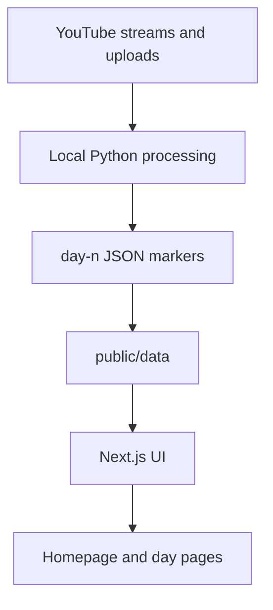

# andalus-taraweeh

A production-ready Ramadan livestream and archive platform for **Andalus Centre Glasgow**.

Built for people who want to join nightly Taraweeh live, revisit previous recitations, and follow Quran progress with ayah-level context.

## Highlights

| Capability | Why it matters |
| --- | --- |
| Live + archive in one product | Join now or catch up later in the same flow |
| Ayah-level indexing | Jump to precise recitation points instead of scrubbing blindly |
| Arabic + English context | Listen and read together for stronger understanding |
| Multi-part day support | Real-world split uploads handled cleanly |
| Local AI pipeline | Generates timeline JSON without backend complexity |

## User experience

- Homepage with nightly status and countdown.
- Dedicated day pages for archive playback.
- Surah/ayah navigation tied to video timestamps.
- "Now Reciting" context with manual sync controls.
- Indexed surah/ayah markers rendered from static JSON.

## Tech stack

| Layer | Stack |
| --- | --- |
| Framework | Next.js 14 (App Router), React, TypeScript |
| Styling | TailwindCSS |
| Video | YouTube iframe player |
| Data delivery | Static JSON under `public/data/*` |
| AI processing | Local Python scripts (`scripts/ai_pipeline/*`) |
| Deployment | Vercel |

## Architecture



## Repository structure

```text
andalus-taraweeh/
├─ app/                        # Next.js App Router pages/layout
├─ components/
│  ├─ day/                     # Day player and recitation UI
│  ├─ home/                    # Homepage sections
│  └─ shared/                  # Shared UI blocks
├─ data/                       # Static configs (videos, highlights, metadata)
├─ public/data/                # Generated timeline JSON consumed by UI
├─ scripts/
│  ├─ ai_pipeline/             # Matching/transcription/alignment logic
│  ├─ reels/                   # Reel helper scripts
│  └─ process_day.py           # Main local processing entrypoint
└─ README.md
```

## Quick start

```bash
npm install
npm run dev
```

Open [http://localhost:3000](http://localhost:3000).

Production preview:

```bash
npm run build
npm run start
```

## Configuration

### Day video mapping

Edit:

- `data/taraweehVideos.ts`

Supports single video or multi-part day arrays.

### Manual video override

Append query param:

- `?video=VIDEO_ID`

Example:

- `http://localhost:3000/day/1?video=VIDEO_ID`

## Data model

### Day files

- `public/data/day-{N}.json`
- Multi-part examples:
  - `public/data/day-2-part-1.json`
  - `public/data/day-2-part-2.json`

### Marker quality

Markers can include quality hints:

- `high`
- `ambiguous`
- `inferred`
- `manual`

### Optional AI hook files

- `public/data/day-{N}.json` can include extra indexing metadata used by UI hooks.

## Local AI pipeline

The pipeline is local-only (not executed in Vercel runtime).

Primary entrypoint:

- `python scripts/process_day.py ...`

Related docs/tools:

- `scripts/README.md`
- `python scripts/fetch_quran_corpus.py`
- `data/ai/prompts/day-highlights-prompt.md`

### Progress visibility

`process_day.py` prints stage-by-stage progress and writes timing metrics into output JSON:

- `meta.pipeline_timings_seconds`

### Day overrides

Manual anchors/bounds live in:

- `data/ai/day_overrides.json`

Useful keys:

- `start_time`
- `final_time`
- `start_surah_number`
- `start_ayah`
- `marker_overrides`

### Day highlights workflow (saved prompt only)

For daily Quran highlights/dua/famous-ayah content, use the saved prompt template only:

- `data/ai/prompts/day-highlights-prompt.md`

Expected process:

1. Fill template placeholders (`DAY_NUMBER`, recitation range, optional marker note) from the current day markers.
2. Generate JSON in the exact output schema from that prompt.
3. Save report to:
   - `data/ai/reports/day-{N}-highlights-ai.json`
4. Update UI source of truth:
   - `data/dayHighlights.ts`
   - Add/update `dayHighlights[N]`
   - Add/update `dayCorpusSummaries[N]`

Rule:

- Do not use ad-hoc prompt text for day highlights. Reuse only the saved template above for consistency across days.

## Deploy to Vercel

1. Push repo to GitHub.
2. Import in Vercel.
3. Keep default Next.js settings.
4. Deploy.

## Operational notes

- Frontend is static-deploy friendly.
- No backend service required for playback/index rendering.
- Daily AI processing can run locally and commit updated JSON.

## License / usage

Internal/community project for Andalus Centre Glasgow operations.
