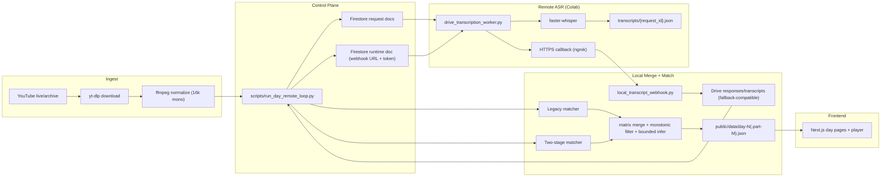

# Andalus Taraweeh

High-accuracy Taraweeh tracking for **Andalus Centre Glasgow**.

The project combines a Next.js archive UI with a local + Colab transcription pipeline that produces ayah-level timeline markers per day.

[](https://nextjs.org/)
[](https://www.typescriptlang.org/)
[](https://www.python.org/)
[](https://github.com/SYSTRAN/faster-whisper)
[](https://firebase.google.com/docs/firestore)
[](https://ngrok.com/)

## What this repo ships

- Archive-first UI with live/day navigation.
- Ayah markers with confidence, quality tags, and reciter labels.
- Split-stream day support (`day-N-part-M.json`).
- Remote transcription orchestration (Drive + Firestore + HTTP callback).
- Dual-transcript, dual-matcher merge strategy for stronger marker quality.

## Architecture

Detailed diagrams: [docs/ARCHITECTURE.md](docs/ARCHITECTURE.md)


```mermaid
flowchart LR
    subgraph Ingest["Ingest"]
        YT["YouTube live/archive"] --> DL["yt-dlp download"]
        DL --> FF["ffmpeg normalize (16k mono)"]
    end

    subgraph Control["Control Plane"]
        LOOP["scripts/run_day_remote_loop.py"] --> FS1["Firestore request docs"]
        LOOP --> RT["Firestore runtime doc (webhook URL + token)"]
    end

    subgraph Worker["Remote ASR (Colab)"]
        W["drive_transcription_worker.py"] --> FW["faster-whisper"]
        FS1 --> W
        RT --> W
        FW --> TR["transcripts/{request_id}.json"]
        W --> POST["HTTPS callback (ngrok)"]
    end

    subgraph Local["Local Merge + Match"]
        POST --> WH["local_transcript_webhook.py"]
        WH --> DR["Drive responses/transcripts (fallback-compatible)"]
        DR --> LOOP
        FF --> LOOP
        LOOP --> M1["Legacy matcher"]
        LOOP --> M2["Two-stage matcher"]
        M1 --> MERGE["matrix merge + monotonic filter + bounded infer"]
        M2 --> MERGE
        MERGE --> OUT["public/data/day-N(.part-M).json"]
    end

    subgraph UI["Frontend"]
        OUT --> NX["Next.js day pages + player"]
    end
```

## Matching strategy (current)

`run_day_remote_loop.py` default mode is `dual_vad_matrix`:

1. Generate full transcript with VAD on.
2. Generate full transcript with VAD off.
3. Run both matchers on both transcripts:
   - `legacy + vad_on`
   - `legacy + vad_off`
   - `two_stage + vad_on`
   - `two_stage + vad_off`
4. Merge markers with priority:
   - strong legacy markers first
   - strong two-stage markers to fill gaps
   - bounded inferred markers last
5. Enforce monotonic Quran order and apply day overrides.

Artifacts are written under:

- `data/ai/remote_jobs/day-{N}/transcripts/`
- `data/ai/remote_jobs/day-{N}/outputs/`
- `data/ai/remote_jobs/day-{N}/iteration_report.json`
- final UI file: `public/data/day-{N}.json` (or `day-{N}-part-{M}.json`)

## Repository map

```text
andalus-taraweeh/
├─ app/                              # Next.js routes
├─ components/                       # UI components
├─ data/
│  ├─ ai/day_overrides.json          # Manual anchors/blocks/reciter windows
│  ├─ quran/                         # Quran corpus + translation cache
│  └─ taraweehVideos.ts              # Day -> video mapping
├─ public/data/                      # Published day marker JSON
├─ scripts/
│  ├─ run_day_remote_loop.py         # Main remote orchestration loop
│  ├─ process_day.py                 # Local direct processing entrypoint
│  ├─ ai_pipeline/                   # Matching/transcription/merge internals
│  └─ colab/                         # Colab worker, webhook, ngrok helpers
└─ README.md
```

## Frontend quick start

```bash
npm install
npm run dev
```

Open [http://localhost:3000](http://localhost:3000).

Production preview:

```bash
npm run build
npm run start
```

## Pipeline quick start (local + Colab)

### 1) Install AI dependencies

```bash
python3 -m venv .venv
source .venv/bin/activate
pip install -r scripts/requirements-ai.txt
brew install ffmpeg yt-dlp
```

### 2) Configure local bridge (gitignored)

```bash
cp scripts/colab/local_config.example.json scripts/colab/local_config.json
```

Fill placeholders in `scripts/colab/local_config.json`:

- `drive_root`
- `callback.url`, `callback.bearer_token`
- optional `firestore.*` values

### 3) Start ngrok tunnel (local)

```bash
python scripts/colab/start_ngrok.py --config scripts/colab/local_config.json
```

Use the returned public URL with `/ingest/transcript`.

### 4) Run day loop (local)

```bash
python scripts/run_day_remote_loop.py \
  --day 17 \
  --youtube-url "https://www.youtube.com/live/8J4moM97CmQ" \
  --drive-config scripts/colab/local_config.json \
  --firestore \
  --webhook-public-url "https://<your-ngrok-domain>/ingest/transcript" \
  --webhook-token "<YOUR_TOKEN>" \
  --output public/data/day-17.json
```

### 5) Start Colab worker

In Colab (with Drive mounted + repo/scripts available):

```bash
pip install faster-whisper yt-dlp requests
python scripts/colab/drive_transcription_worker.py --config scripts/colab/local_config.json
```

## Optional local-only mode

Skip remote orchestration and run directly against YouTube/local audio:

```bash
python scripts/process_day.py \
  --day 1 \
  --youtube-url "https://www.youtube.com/watch?v=..." \
  --output public/data/day-1.json
```

## Data model

Each `public/data/day-*.json` contains:

- `markers`: ayah timeline rows (`surah`, `ayah`, `time`, `reciter`, `quality`, `confidence`)
- `meta`: pipeline provenance, matcher configs, overrides, timing stats, merge diagnostics

Quality labels:

- `manual`
- `high`
- `ambiguous`
- `inferred`

## Config and secret hygiene

- Keep secrets in `scripts/colab/local_config.json` only.
- `scripts/colab/local_config.json` is gitignored.
- Use committed placeholders:
  - `scripts/colab/local_config.example.json`
  - `scripts/colab/local_config.template.json`

## Day overrides

Manual controls live in `data/ai/day_overrides.json`, including:

- `start_time` / `final_time`
- `start_surah_number` / `start_ayah`
- `marker_overrides`
- `match_blocks`
- `manual_reciter_windows`
- `duplicate_markers`

## Deployment

Frontend deploys to Vercel as a standard Next.js app.

The Python/Colab pipeline is external to Vercel and publishes static JSON into `public/data/`.

## License / usage

Internal/community project for Andalus Centre Glasgow operations.
