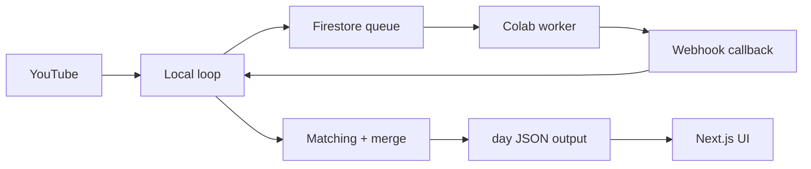
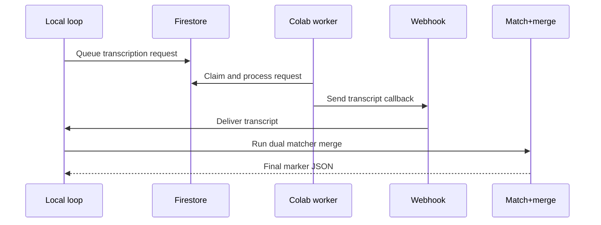

# Architecture

This system is built as a local-first orchestration loop with remote GPU transcription workers.

## 1) High-level components

## 2) Simple request flow

## 3) Merge logic

1. Generate two transcripts: VAD on + VAD off.
2. Run both matcher modes on both transcripts (4 outputs).
3. Keep strongest per ayah key from legacy first, then two-stage.
4. Enforce monotonic Quran timeline.
5. Add bounded inferred markers only when gap constraints are satisfied.
6. Apply manual overrides and final boundary constraints.

## 4) Outputs

- Local artifacts:
  - `data/ai/remote_jobs/day-{N}/transcripts/*.json`
  - `data/ai/remote_jobs/day-{N}/outputs/*.json`
  - `data/ai/remote_jobs/day-{N}/state.json`
  - `data/ai/remote_jobs/day-{N}/iteration_report.json`
- Published artifacts:
  - `public/data/day-{N}.json`
  - `public/data/day-{N}-part-{M}.json`
